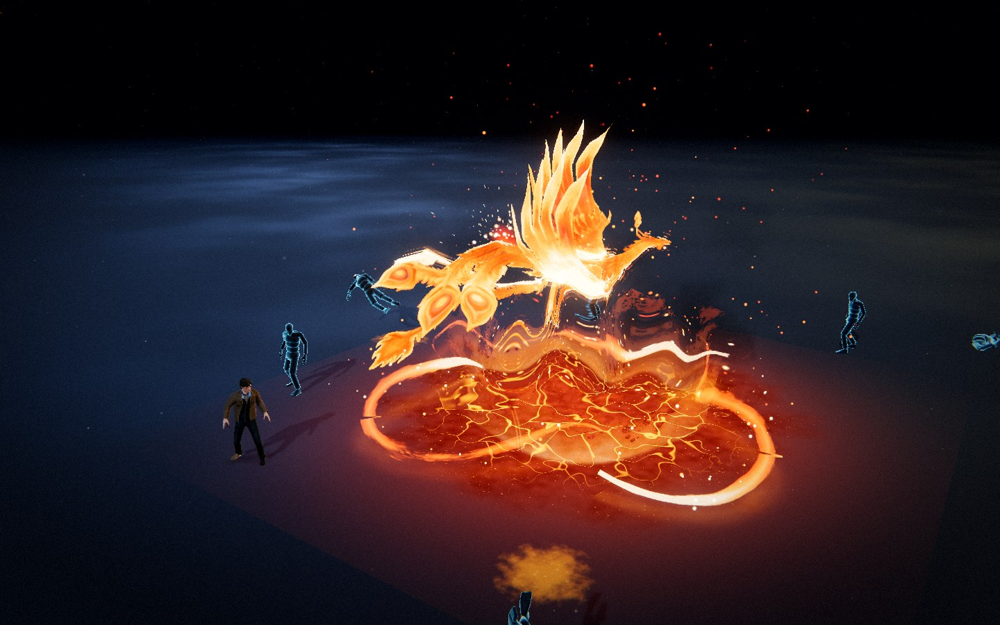
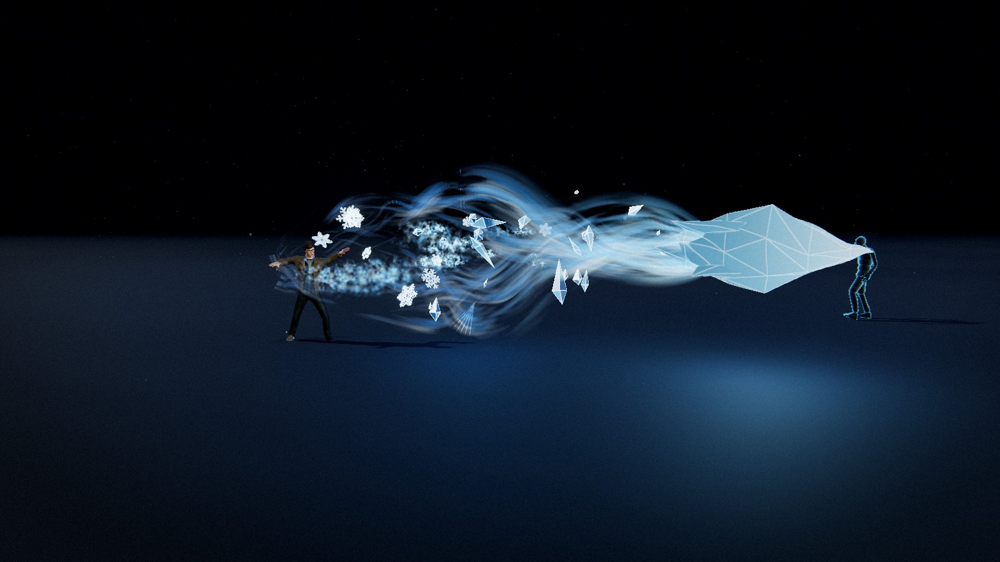
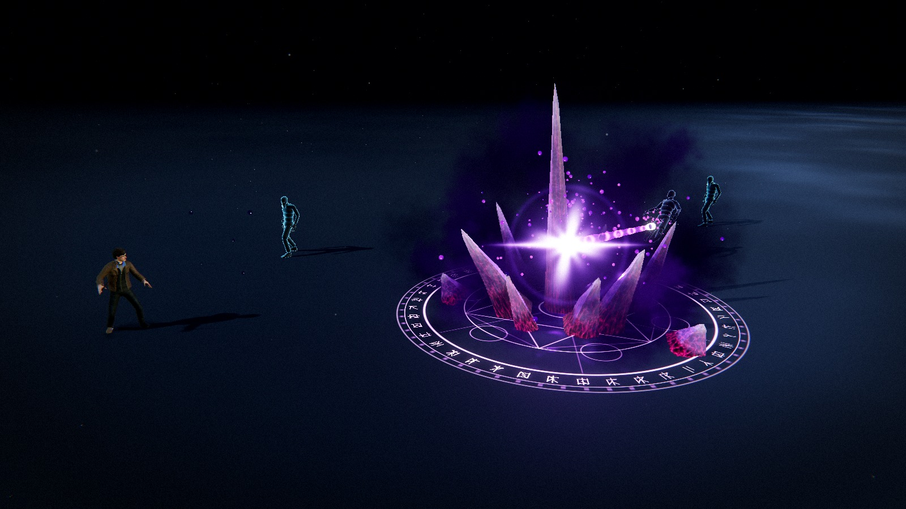
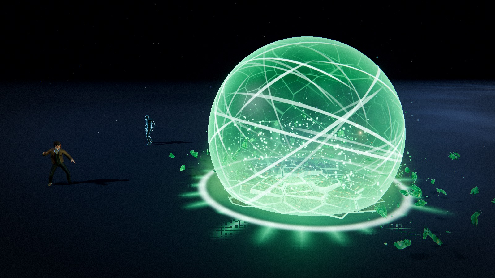
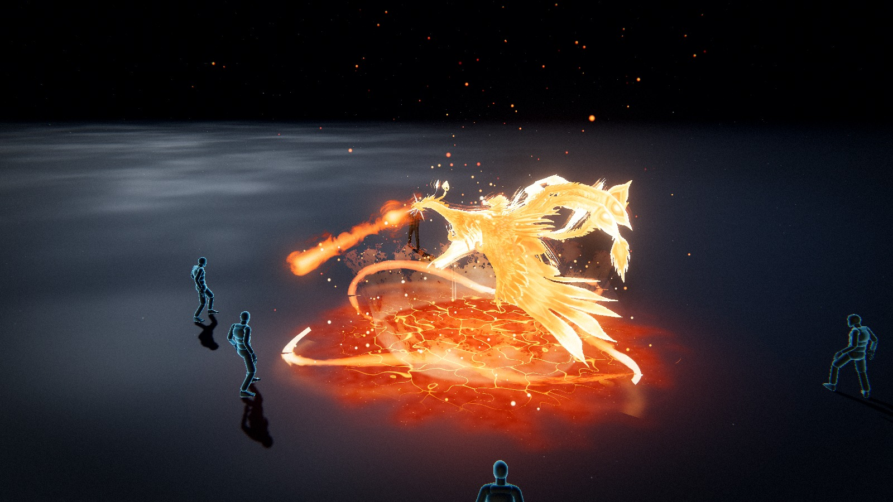
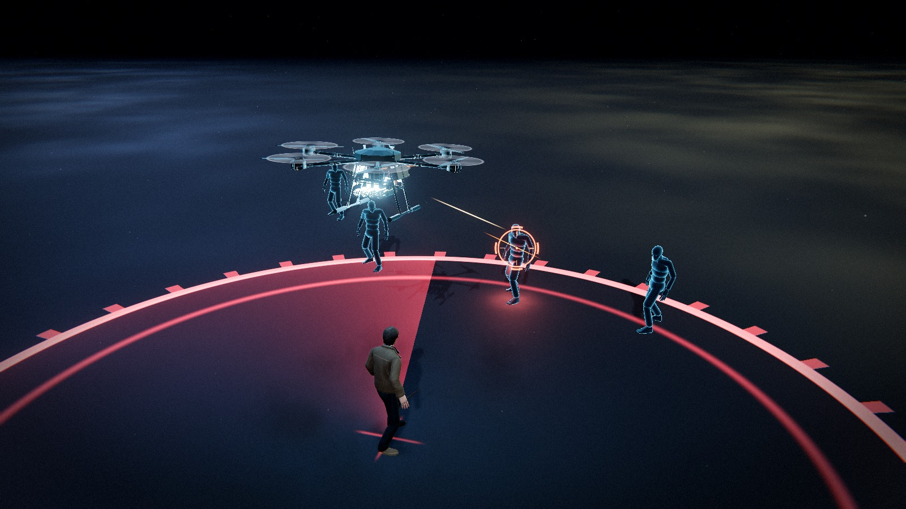

# Elemental Sandbox

A skillshot VFX sandbox built with **Three.js**, **Vite** and hand-written **GLSL**.




Nine abilities and three ways to aim them. Three are **line casts**: press the key to arm, a
League-of-Legends style arrow appears on the ground and swings with the mouse, click to fire. Four
are **far casts**: the arrow is replaced by a circle with a deliberately thick boundary that follows
the cursor and answers the only question a ground-targeted AoE has to answer before you commit — how
much space is this going to take. The other two are **summons**: press the key and a construct
deploys and takes the controls; press it again to recall it.

---

## The nine abilities

The frames on this page are the renderer's own output, captured from the running sandbox at the
moment the cast peaks. No compositing, no touch-up, and nothing in shot that the app does not draw
itself. They are in slot order, which is also the order of the keys.


**Q — Shimmering Flux of Chaos** · <sub>line cast</sub> — a lattice funnel ploughing point-first behind a
bouquet of crimson and rose ribbons, with fluid blood torn off it in stretching ligaments. Built
to a six-panel breakdown sheet and to nothing else: the conical mesh trail, the fluid blood
splatter, the chaotic energy ribbons, the glinting sparkles, the distortion wave and the lingering
crimson motes, all placed against one curve that is a pure function of distance travelled — which
is what makes the trail a record of where the projectile actually went rather than a shape that
swims along behind it.


**E — Linear Void Slash** · <sub>line cast</sub> — built to a six-panel breakdown sheet: shadow core
beam, particle debris, shadow ribbon trails, energy sparks, distortion wave, lingering shadow motes.
The ability draws five of the six — the distortion wave is left out, so it writes nothing to the
distortion layer — and adds nothing: no floor decal, no pressure shell, no screen flash, and no
particle system anywhere in it. It flies **point first**: the composite's obsidian lance is the
compact, pointed shape and everything streams away from it, the debris fanning wider the further back
it gets, so the lance is the nose and the rest is the wake. The lance is a pointed envelope
**shingled with flakes of black glass** — one instanced draw of knapped obsidian chips, packed tight
at the point like the scales of an arrowhead and lifting off toward the rear until they come away —
and it is a *solid*: it writes depth and has a silhouette, which is the one thing an additive beam
can never have and the reason the front of the shot reads as a point. Each flake is flat-shaded off
its own face normal and posterised against a camera-relative key, with a violet rim on its
silhouette, one tight glass highlight, a screen-space hairline along every facet edge and a vein of
void light down its middle with pulses running to the point. Down the axis, a white-violet filament
with tight satellites winding round it, pinched to nothing at the point, and a four-rayed glare
pinned to the tip that is the brightest thing in the ability. Behind it the wake, every piece of it
a pure function of the clock and how far the head has flown, with no history buffer: the same flakes
loosed off the lance's frayed rear, keeping most of its speed as a slip back down the flight path
and tumbling out on a drag curve, a few still lit from inside; broad silks of **shadow** wound about
the wake and opening wider toward the tail, drawn premultiplied-over so their bodies darken what is
behind them and only their hems and their pulses add light; a trail of four-rayed sparks; a proxy on
the distortion layer that lenses the frame along the heading and *swirls* it about the head in
spiral arms; and, furthest back, soft puffs of violet smoke laid down where the lance passed and left
there, thinning from their edges in, with bright motes drifting up through them. On the strike the
lance is what hits: its scales are blown off it white-hot and tumble away, the beam's point flares
and snaps back, a shell of sparks is thrown, the distortion fires its big packet — and the wake does
not take part, because it is the record of where the shot has been; the strike only stops laying it
down, and the motes are the last thing on screen.



**R — Glacial Shard Storm** · <sub>line cast</sub> — built to a five-panel breakdown sheet:
subsurface ice mesh, fluid frost vapour, ordered frost lattice, glinting ice shards, refractive
distortion. The ability draws all five and adds nothing: no floor decal, no pressure shell, no
screen flash, no particle system. It flies **crystal first**. The crystal is one procedural gem —
a needle of a nose, a wide girdle, a chipped rear and three smaller crystals twinned onto its
flanks — and it is drawn *twice*: its back faces first, because the facets you see through a
translucent stone are the inside of its far wall, flat-shaded from within in the deep glacial
blue with their edges as the internal facet lines; then its surface over them, translucent, with
an ice fresnel that reflects the stage's own HDR probe, one tight sun highlight, light scattered
through the thin nose toward the eye, fracture planes a little way inside seen through the surface
at a refracted parallax so they shift against the facets as the view moves, a haze of trapped air
deeper still, and a frost lattice etched over the rear facets. It writes depth, it has a
silhouette, and its nose is brilliant. Behind it the vapour: soft sprites laid down where the
crystal passed and advected by curl noise so they coil, each one drawn out along its own motion —
the share that still sheath the crystal are streamers, the ones left behind bloom into puffs — and
*lit*: two samples of the same noise a little apart give every puff a light side and a shadow
side, which is what separates vapour from a fog card; with a few broad silks wound loosely about
the wake and eroded into the long streamers that reach furthest back. Hanging in it, the
lattice: snowflakes, a six-fold dendrite signed distance field tumbling on sprites, no two alike —
the spar width, the count and reach of the side branches, the hexagonal plate and the ring are
rolled per flake. Around it the shards: bipyramid gems and splinters struck off the crystal and
left tumbling, flat-shaded ice with the light coming through their tips, and a four-rayed glint
pinned to each one that flashes as its facets turn through the key. And on the distortion layer,
the lens: the frame pulled in through the crystal like a ball of glass, a bow wave standing ahead
of its nose, rings shed behind it. On the strike the crystal comes apart facet by facet — every
triangle of it a rigid sliver, tumbling, flashing white — the vapour gouts, a shell of snowflakes
and of shards is thrown, the lens fires one big ring, and the wake does not take part: the strike
only stops laying it down, and the vapour is the last thing on screen.



**X — Corrupted Shard Spawn** · <sub>far cast</sub> — a rune cut into the floor, a cluster of corrupted
amethyst torn up through it (one spire, a ring of blades, a skirt of shards), a crown of dark water
thrown up as they break the floor, dark mist and beads of corruption coiling round them, and a lens
star ignited in the heart of the cluster. Built to a six-panel breakdown sheet, plus the one thing
the composite implies and the sheet does not draw: the star is a *light source*, so once it is lit
it picks the nearest body in reach, visibly gathers itself — the flare swells, the flaws in every
crystal run hot, the hub of the rune fills — and fires a beam of that light straight through it.
What it hits is thrown, then burnt out from the inside.


**B — Glacial Prison** · <sub>far cast</sub> — built to a six-panel breakdown sheet, and the one cast
that freezes what it catches instead of knocking it down. Nothing runs out from the caster's feet:
the prison is simply there, where it was aimed, on the frame it is cast, and the floor under it
freezes — a sheet of ice racing out to the radius and
feathering past it, with a crack network glowing from *inside* it: the cracks are drawn at a parallax
depth under the surface, so they shift against the frost on top as the camera moves and the sheet
reads as a slab rather than a decal. A cylinder of ice stands up out of it to twice a body's height:
a shell striated where it froze upward, frosted in patches and clear elsewhere, the far wall dimmer
through the near one, the stage's HDR probe and the sun in it, and a proxy on the distortion layer so
the stage bends through it like thick glass. Cold air rolls off the foot of the wall — puffs of
eroded smoke, white and heavy, hugging the floor and coiling round the prison as they thin, lit
cyan from the centre — while
a crown of faceted crystals grows at the wall's foot and splinters lift off the floor inside,
tumbling, each facet catching and losing the sun. And the bodies: everything standing in the circle
is **frozen where it stands**. The rig's animation is abandoned mid-breath and its pose is baked, every
skinned vertex pushed through its bones once, into a statue that stands exactly where the body was.
The frost climbs it from the feet as a crystallising line; below the line it is glass — a real
`MeshPhysicalMaterial` with a clearcoat, an ice IOR and the dark body visible inside through a deep
blue, so it takes the sun, the shadows and the aura's own light like everything else on the stage.
It holds. Then cracks run up it along the seams it is about to break on — a Voronoi fracture of the
surface, carried in the buffer as a distance to the nearest cell edge — and it **shatters**: forty
pieces of ice, each a rigid body with its own velocity, tumble and gravity, thrown outward, landing on
the floor with a bounce and a skid, lying there, and melting into it. One draw call per body
throughout; the pieces read their transforms out of a uniform array. It dies the way ice does: the
wall goes from the top down behind a rime edge, the crystals melt back into the floor, the sheet
loses its light and the frost recedes.


**Z — Toxic Shield of Conquest** · <sub>far cast</sub> — built to a four-panel breakdown sheet: the
crystalline barrier mesh, the poison gas miasma, the ground rupture decal and the radial shockwave
ring, and one idea under all of them — it is all the same glass. Nothing runs out from the caster's
feet: the shield is simply there, where it was aimed, on the frame it is cast, and the floor under
it breaks: a Voronoi plate (`assets/ShatterGeometry.js`), cut
fresh, heaved and canted about every slab's own centroid, the stone scan on top, toxic light coming up
through every seam and wall, a crack network over the plates and embers — the stage was burning when
it broke — still flickering along the cracks. A ring of light is thrown across the floor as it lands,
a comb of spiked flares off its edge, and another on every beat while the shield stands. Then the
barrier: a sphere of toxic glass stands up out of the rupture with a **lattice of crystal spars**
grown over it — up to twenty-eight great-circle arcs of random length, thick where they bulge and
pinched where they thin like needles, drawn from their middles outward as it rises, a pulse of light
running along each and a flare at every crossing — over a finer cellular facet network; fresnel glass
between them with the stage's HDR probe and the sun in it, poison swirling inside, lit from the
rupture at its foot, the far wall dimmer through the near one, and a proxy on the distortion layer so
the stage bends through it like a ball of glass. Poison gas seeps out from under it: puffs of eroded
smoke coiling round the barrier as they thin, green where the light gets it and bruise purple in
its own shadow, lit from the venom at the centre, while spores drift up through it inside. And the
bodies: everything standing
in the circle is **turned to glass** where it stands. The rig's pose is baked into a statue (the same
machine as the Glacial Prison) and the conversion runs *per fracture cell*: the seams the body will
break along light up first, a lattice climbing from the feet ahead of a crystallising front, and the
glass sets behind it facet by facet — a real `MeshPhysicalMaterial` with a clearcoat, a glass IOR and
the dark body visible inside through a bottle green, the same palette as the barrier. It holds. The
seams brighten to the lattice white and it **shatters**: the pieces fly, tumble, land and lie there as
glass, then dissolve into vapour behind a hot green edge. It dies the way glass does: the barrier's
facets flash and fall out one by one, throwing shards, the slabs sink back into the floor, the seams
go dark and the gas thins.





**F — Serpent Tide Field** · <sub>far cast</sub> — a phoenix climbs out of a pyre and hunts: fireballs
from the beak for the far ones, talons for the near ones. That is the shot at the top of the page,
and the one taken apart below.


**V — Monowheel Bot** · <sub>summon</sub> — the Sentinel Drone's principle (below), on the
ground. An armoured one-wheeled sentry (`models/monowheelArmyBot.glb`) prints itself in on the
floor in front of the caster, balances up and waits; the same slot recalls it. Every control the
drone answers, this answers, so `App` drives both through one deck — the difference is what the
stick *means* to a machine that cannot leave the floor. Free, it turns to face the stick and drives along its heading,
the throttle scaled by how squarely it is facing the demand, so a push behind it is a pivot first
and a run second; locked onto a target it faces the target instead and the stick becomes a tank's,
forward closes and back backs off. The tire rolls by exactly the distance travelled, so the tread
never slides at any size or speed the editor sets, and it is a self-balancing machine, which is
what sells it: the hull leans forward to accelerate, leans into every turn, rocks back on each
round it fires and never quite holds still. Two guns on the nose, a burst alternating them, each
round with its own muzzle flash and a casing thrown out of its own side; a headlamp cone off the
nose in place of the drone's searchlight, swinging onto whatever it is about to shoot; dust off
the tread.



**Y — Sentinel Drone** · <sub>summon</sub> — not a cast. Press the slot and the airframe
(`models/drone.glb`) prints itself in over the caster's head, spins up, climbs to station and
waits; press it again to recall it, and until then the other slots are locked, because the caster
is flying it. The stick — **WASD**, or the open hand pushed off the middle of the frame in camera
mode — is a camera-relative velocity demand, damped, leashed to the caster, and the body banks into
it the way a multirotor does: nose down to go forward, a shoulder down to go sideways. Hold fire
and it hunts: it asks the field who is standing in its ring, turns onto the nearest, and the
reticle closes on them over `lockTime`; once the heading is inside `lockCone` it empties a burst —
tracers from the socket, a flash, casings off the side — and the first round to arrive knocks the
body down along the shot. Then the next one, for as long as the fire is held. Under it the show: a
range ring on the floor with a radar sweep that runs hot while it hunts, a searchlight standing
under the body that swings onto whatever it is about to shoot, rotor blur, nav lights, and the
downwash lifting dust off the stone.

---

## One of them, up close


**F — Serpent Tide Field.** A far cast built to a seven-panel breakdown, and the one with a
*creature* in it. The seed is a comet lobbed at the circle; where it lands the crust splits into
glowing plates, a pyre erupts, and the phoenix (`models/phoenix_bird.glb`, skinned and flapping)
climbs out through a molten line on the floor. Its plumage is a **fresnel of fire**: the body is
shaded as a Planckian radiator whose temperature is read off the painted feathers, the flames
climbing the surface and the rim, with two additive shells stood off the skin carrying the tongues
that leave the silhouette. Then it hunts. Whoever is standing in range is taken **one at a time**,
nearest first — a body out past `kickRange` gets turned onto and a quick volley of homing fireballs
from the beak, and the first to arrive kicks it off its feet along the shot; a body close in gets
the talons, a dive off the hover with a gout of fire under it. Around the pyre: three serpents of
fire winding on S-curves placed entirely in a vertex shader, a skirt of wispy flame torn into
tongues, the scorched cracked crust lit from underneath, a column of heat shimmer, and embers
everywhere. When the field burns out the bird flares, lifts, and goes to embers from its coolest
feathers first.

Everything you can see is generated. The only meshes on disk are the character, the target
dummy, the drone, the bot and the phoenix: the crystals and the obsidian flakes are procedural
geometry, the phoenix's fire serpents and the flux's ligaments are strips of parameter space placed
entirely in a vertex shader, the arrow, the targeting circle, the shard's rune and the ground marks
are signed-distance and noise shaders, and the mist, sparks, chips and glitter are GPU particles.
The **Toxic Shield's ruptured crust is the deliberate exception**: its slabs are procedural geometry
like everything else, but they are *shaded* with the same CC0 ambientCG **Rock030** scan the floor is
dressed with, projected triplanar in world metres. Procedural noise gets you stone that looks like
stone; it does not get you stone that looks photographed, and a floor that has just broken depends
on the second one.

**Every parameter is a live control** — 1,572 sliders and toggles, plus 186 colour pickers — and they stay live while the simulation is
paused. That is the point of the project: freeze a frame mid-eruption, mid-strike or mid-burn with
**P**, then reshape the silhouette, the palette and the timing against a still image.

---

## Quick start

```bash
npm install
```

```bash
npm run dev
```

Then open the URL Vite prints (default <http://127.0.0.1:5173>).

```bash
npm run dev:lan
```

The same, but reachable from other devices on your Wi-Fi over HTTPS — for
[using a phone as the camera](#using-your-phone-as-the-camera-local-only). Your browser will warn
about the certificate once; it is the dev server's own self-signed one.

```bash
npm run build
```

```bash
npm run preview
```

### Assets

The binary assets are served from `public/` and loaded automatically at boot:

| File | Purpose |
| --- | --- |
| `public/models/Idle.fbx` | Rigged character **and** its idle animation clip |
| `public/models/diffuse.png` | The character's colour map |
| `public/models/cast1.fbx` | Cast animation — the default for the Void Slash and the Shard |
| `public/models/cast2.fbx` | Cast animation — the default for the Drone, the Bot and the Prison |
| `public/models/cast3.fbx` | Cast animation — the default for the Flux, the Serpent Tide Field and the Shield |
| `public/models/dummy.fbx` | The target dummies' rig |
| `public/models/drone.glb` | The Sentinel Drone's airframe |
| `public/models/monowheelArmyBot.glb` | The Monowheel Bot's chassis |
| `public/models/phoenix_bird.glb` | The phoenix, skinned and flapping |
| `public/hdri/spruit_sunrise.hdr` | HDR probe used for image-based lighting and the glass and crystal reflections |
| `public/textures/cathedral/*.jpg` | The ambientCG Rock030 scan — the floor, and the Toxic Shield's ruptured crust |
| `public/mediapipe/` | The hand landmarker model and its WASM, for the camera mode |

The four character FBX files are Mixamo exports of the same rig, each carrying a skinned mesh plus
one animation stack. The character comes from the idle file; the cast files are loaded for their clip
alone, and the duplicate rig that arrives with each one is released the moment its `AnimationClip`
has been taken. Clips bind to the skeleton by bone name, which is the whole reason an animation
authored in another file plays here without retargeting.

The rig ships no material, so `diffuse.png` is loaded beside it and assigned as the colour map when
the imported materials are converted to PBR — an FBX that *does* carry an embedded texture keeps its
own, since that map is authored against its own UVs.

Every ability picks the clip it throws — `castAnim` in its settings block, a dropdown under **The
cast** in its editor folder. Out of the box the Flux, the Serpent Tide Field and the Shield throw
`cast3`, the Drone, the Bot and the Prison throw `cast2`, the Void Slash and the
Shard throw `cast1`, and the Glacial Shard Storm throws `cast3`. The clip is a one-shot laid over the looping idle, with `character.castBlendIn` /
`castBlendOut` as the two edges of that overlap.

The HDR is loaded as image-based lighting and as the reflection source for the crystals and the
glass — it is never shown as a visible sky. The stage keeps its flat dark backdrop.

---

## Controls

| Input | Action |
| --- | --- |
| **Q** (or **1**) | Arm the Shimmering Flux of Chaos — a line cast |
| **E** (or **2**) | Arm the Linear Void Slash — a line cast: an obsidian lance with a wake of shadow |
| **R** (or **3**) | Arm the Glacial Shard Storm — a line cast: a crystal of ice with a wake of frost |
| **X** (or **4**) | Arm the Corrupted Shard Spawn — a far cast whose light fires back |
| **B** (or **5**) | Arm the Glacial Prison — a far cast that freezes what stands in it, then shatters it |
| **Z** (or **6**) | Arm the Toxic Shield of Conquest — a far cast that turns what stands in it to glass, then shatters it |
| **F** (or **7**) | Arm the Serpent Tide Field — a far cast that summons a phoenix to hunt the circle |
| **V** (or **8**) | Deploy the Monowheel Bot — a summon; press again to recall it |
| **Y** (or **9**) | Deploy the Sentinel Drone — a summon; press again to recall it |
| **WASD** / **Space** | With a summon out: drive it, and hold fire |
| **Move the mouse** | Swing the aim arrow, or move the far-cast circle |
| **Left click** | Cast along the arrow, or drop the circle where it is |
| **Esc** / **right click** | Cancel an armed cast |
| **Right mouse + drag** | Orbit the camera |
| **Scroll** | Zoom |
| **G** | Show/hide the VFX editor |
| **P** | Pause / resume — *the editor keeps applying* |
| **C** | Clear all active effects |
| **T** | Reset the target dummies |
| **M** | Camera mode — palm aims, fist casts (**J** swaps hands) |
| **H** | Hide the controls panel |

In camera mode the preview panel carries a **gesture guide** for whatever is in the slot: under
the preview, a tile per pose the tracker reads — open palm, moving palm, fist, point, lowered hand
— with the hand shape drawn large and a line of what that pose does to *this* ability, since a
fist casts a line ability along the arrow, drops a far cast's circle, deploys a summon and holds
its fire once it is out. The guide rebuilds when the slot changes and lights the tile of the
gesture being read, so a pose that did not land is visible as one. It travels with the panel,
which can be dragged anywhere on screen.

### Using your phone as the camera (local only)

No webcam, or a bad one? A phone on the same Wi-Fi can be the camera. Start the dev server with

```bash
npm run dev:lan
```

open the app from the address it prints, press **M**, and click **Use your phone as the camera**
in the panel (it opens on its own when the PC has no webcam). Scan the QR code with the phone,
accept the certificate warning — it is the dev server's self-signed certificate — and tap
**Start camera**. Its picture replaces the webcam in the preview, and the tracking, the gesture
guide and the skeleton carry on exactly as before. **Flip camera** swaps between the selfie and
the rear camera without dropping the link; **Stop** on the phone or **Disconnect** on the PC goes
back to the webcam. Reloading the sandbox keeps the same pairing, so the phone reconnects on its
own without a rescan.

Prop the phone up facing you where a webcam would sit. Front or rear camera both work — a camera
pointed at you sees your right hand on the image's left either way, which is what the tracker
expects of a webcam.

**This works locally only, for now.** The video goes phone → PC directly over WebRTC on your
network; what needs a server is the handshake before that (a few signalling messages), and here
it is relayed by a small Vite dev-server plugin ([`tools/vite-plugin-phone-camera.js`](tools/vite-plugin-phone-camera.js)).
A built, deployed page has no relay, so the panel says so instead of showing a code. Making it
work in production would take a small signalling backend and, for devices off the same LAN, a TURN
server — neither is here because the sandbox is one person at one desk. `phone.html` is not a build
input for the same reason.

Two things bite in practice:

- **HTTPS is required.** A phone's browser only exposes the camera to a secure origin, and a LAN
  address over plain HTTP is not one — hence `dev:lan` rather than `dev --host`.
- **Both devices must be on the same network, with device-to-device traffic allowed.** Guest
  networks and "client isolation" (common on hotel and office Wi-Fi) block it. If the PC has
  several addresses — a Hyper-V or WSL switch beside the real Wi-Fi — the panel picks the
  `192.168.` one and offers the others under the code. Windows Firewall may also ask to allow Node
  on private networks the first time; refusing that leaves the phone unable to reach the server.

`range` and `minRange` are per ability, so the indicator's reach changes with the slot you have
selected. Aiming closer than the selected ability's `minRange` tints it red and refuses the cast;
set `minRange` to 0 if you would rather cast at your own feet, which is what every far cast ships
with — a prison you cannot drop on yourself is missing half its uses. Cooldowns are per ability too,
so spending one slot never locks the other out.

---

## Project layout

```
src/
  abilities/      Ability base class (the travelling front), ShimmeringFluxAbility,
                  VoidSlashAbility, GlacialShardStormAbility,
                  DroneAbility, PhoenixAbility, MonowheelAbility, CorruptedShardAbility,
                  GlacialPrisonAbility, ToxicShieldAbility, pooling manager
  animation/      FBX character loading, AnimationMixer, the per-ability cast clips,
                  the procedural cast lunge
  assets/         Procedural crystal geometry, the ribbon strip, the Voronoi shatter
                  plate, the flux funnel, the ice shards, the void's
                  obsidian flake and sprite, the storm's crystal and sprite, the shard's
                  lance, and the drone, monowheel and phoenix rigs
  combat/         The target dummies: the field, one dummy, and its ragdoll
  config/         settings.js — the single source of truth for every parameter
  core/           App, Renderer, CameraRig, Time, Layers, shared frame uniforms
  effects/        Aim arrow, far-cast circle, ground decals, bursts, light pool, shake,
                  flash, the ice statue (a posed body baked, fractured and simulated)
  input/          InputManager (events), AimController (both targeting shapes),
                  HandInput (the camera mode), PhoneCamera + PhoneSignal (the phone
                  as the camera, over WebRTC)
  loaders/        AssetLoader with a shared LoadingManager, and the shared stone scan
  materials/      FluxSpine + the flux set, VoidSpine +
                  VoidSlashMaterials, GlacialSpine + GlacialShardStormMaterials, the drone,
                  phoenix, shard, glacial and toxic material sets, and the stone surface
                  model
  particles/      GPU particle system + engine and rate emitters
  postprocessing/ Composer pipeline, grade shader, distortion shader
  shaders/lib/    Shared GLSL: noise library, common helpers
  phone/          The page the phone opens — its camera, streamed to the desktop
  ui/             HUD, the camera panel, its gesture guide and the phone pairing, lil-gui
                  editor, preset manager, styles
  utils/          Maths, colour cache, pooling, disposal, shader patching
  world/          Environment (stage lighting), floor, dust, contact shadows
  archive/        The retired four-element sandbox — see archive/README.md
tools/
  vite-plugin-phone-camera.js   The dev-server signalling relay behind the phone camera
phone.html        The phone's page (dev server only; not a build input)
```

---

## How it fits together

### Settings are the API

`src/config/settings.js` holds every tweakable value. Nothing else owns that state: shaders,
particle systems, lights and post passes *read* those objects every frame. That is what makes the
editor work with no rebuild — moving a slider changes the crystal field that is already standing,
the next cast, the environment and the post stack at once. Preset loading deep-merges *into* the same
objects so every live binding stays valid.

```js
import { settings } from './config/settings.js';
settings.frost.wallHeight = 7;    // visible on the next frame, even mid-cast
settings.shard.zoneRadius = 8;    // re-seats a spawn that is already standing
settings.global.timeScale = 0.1;  // slow the whole cast to a crawl
```

Ability blocks are keyed by their id in `ELEMENTS`, and the shared systems that need to know
"which ability is the player holding" — the aim controller, the cooldowns, the HUD — look it up as
`settings[element]`. The four fields they rely on being present are `range`, `minRange`, `speed`
and `cooldown`; a far cast adds a fifth, `zoneRadius`. Everything else in a block is that ability's
own business.

### The rule that makes "edit while paused" work

A cast of `CorruptedShardAbility` captures **a seed and a handful of timestamps**, and nothing
else. Not one metre, radian or second is recorded when the cast starts: the footprint, the cluster,
the crown, the flare and the light are all resolved against `settings.shard` inside the update
loop, which runs on a zero-length frame too. Every crystal's place in the cluster is a *fraction*
of the footprint derived from its seed, so dragging `footprint radius` while a spawn is standing
re-seats the rune, the crystals and the crown around it together. The timestamps are events, not
dimensions.

The four *shape* controls (`crystalFacets`, `crystalTaper`, `crystalRough`, `crystalBend`) cannot
be expressed as a per-instance transform, so they are baked into the geometry instead — and a
seven-sided crystal is a couple of hundred triangles, cheap enough to regenerate outright rather
than approximate in a vertex shader. `CorruptedShardAbility#_syncGeometry` hashes those four values
and rebuilds the crystal meshes when the hash changes, carrying the per-instance attributes across,
which is what keeps them live sliders rather than restart-required constants.

### Aiming

`AimController` raycasts the pointer onto the ground plane **every frame**, not only on mouse
move, so orbiting the camera with a cast armed swings the indicator under a stationary cursor. It
clamps the distance into `[minRange, range]`, tracks a 0..1 reveal envelope, and emits a single
`cast` event carrying an origin, a unit direction and a distance — which is exactly the signature
`Ability#spawn` takes. It decides nothing about what the cast does.

It runs on **real** time rather than the scaled simulation delta, so the indicator keeps animating
while the sandbox is paused.

There are two indicators and one controller. Which one is drawn comes from
`ELEMENT_META[element].cast` — `CastShape.LINE` or `CastShape.ZONE` — and that is the *only* thing
the two shapes disagree about. Arming, clamping, validating, revealing and firing are shared, and
both end in the same three-argument `cast` event, because from the targeting side a far cast is a
line cast you only care about the far end of. That is why zone targeting needed no change in
`Ability`, `AbilityManager` or `App`: a far cast reads its centre as `pointAt(1)` and works
outward from there.

### The far-cast circle

`ZoneIndicator` is the arrow's opposite number, and it is built out of the same two ideas: metres,
and no textures.

The **footprint** is one quad whose fragment shader remaps UV into metres from the target, so the
boundary stays 0.34 m thick whether the circle is 2 m or 8 m across. The band is deliberately the
heaviest mark on screen — it is the whole message — and it is split about the nominal radius by
`boundaryBias` rather than centred on it, so its *outer* lip stays honest about where the effect
ends. Inside there is a rim-weighted wash, contour rings travelling outward, warped filaments and a
reticle whose downrange arm is longer, because the quad carries the caster's yaw and that arm is
therefore the heading.

The **reach ring** at the caster is the ribbon strip bent into a circle: `(t, side)` in,
world position out. A quad big enough to hold a 20 m range would be 40 m across and shade a
screenful of discarded fragments for one thin line.

The circle **snaps out past its radius and settles back** when the cast is armed, and the trap does
the same thing when it lands. A circle that grows linearly reads as a UI element; one that
overshoots reads as something the caster did.

A **summon** (`CastShape.SUMMON`) is the third answer, and it is not aimed at all: the slot is a
toggle, the construct takes the stick, and every other slot is refused until it is recalled. `App`
owns that lock.

### The arrow is one SDF

`AimIndicator` is a single ground quad. Its fragment shader remaps UV into **metres measured from
the caster**, so every control in `settings.aim` is a real measurement — the shaft stays 0.42 m
wide whether the cast is 3 m or 15 m long.

The silhouette is a rounded union of a box (the shaft) and iq's exact triangle SDF (the head);
the cheap half-plane intersection leaves visible corner artefacts on a wedge this shallow. From
that one distance field the shader derives the outline, the rim-weighted interior wash, the
chevrons (a phase skewed by `|x|`, which turns flat bands into arrowheads pointing the way the
cast does), the frost noise and voronoi plates, the ring at the caster's feet, the range cap arc,
a six-fold frost rosette pinned to the impact point, and the sweep-out when the ability is armed.

### Lit geometry with a hand-written vertex stage

The ice statue — the body the Glacial Prison freezes and the Toxic Shield turns to glass — is a
real `MeshPhysicalMaterial` with its vertex stage replaced: three's shading model, our placement.
Fire and lightning *are* light; a body is matter, and matter that does not sit in the sun, take a
shadow and occlude what is behind it reads as a decal wrapped around the scene however good its
silhouette is. Two things fall out of that and both are load-bearing. The shadow pass needs the
*same* vertex stage, so the material hands back a matching `MeshDepthMaterial` for the mesh's
`customDepthMaterial`. And it needs a layer of its own: `LAYER.SHAPED` exists because the depth
prepass draws the whole world layer with one `overrideMaterial`, which would rasterise the standing
body under the flying pieces straight into the soft-particle depth buffer. The shadow map is the
one pass where three honours `customDepthMaterial`, so the statue casts properly and stays out of
the prepass.

There is a second three.js footgun in the same neighbourhood, and it cost a debugging session worth
recording: three keys its **program cache** off `customProgramCacheKey()`, whose default is
`onBeforeCompile.toString()` — and `patchOnBeforeCompile` installs a function with the *same* source
text on every material it touches. Three materials that patch the same base with the same parameters
therefore shared one compiled program, and the second and third silently rendered with the first
one's shader. Nothing errors. `patchOnBeforeCompile` now folds the patch's own source into the key,
which fixes it for every caller in the project.

### Adding another ability

1. Add a settings block in `config/settings.js` and an entry in `ELEMENTS` / `ELEMENT_META`.
2. Subclass `Ability` and implement `createShaders`, `createParticles`, `onTravel`, `onImpact`,
   `onFade`.
3. Register the class in `abilities/AbilityManager.js`.
4. Add an editor folder in `ui/Editor.js`, and a sigil in `ui/glyphs.js`.
5. Bind a key in `input/InputManager.js` — it emits `ability` with the 0-based slot index, which
   `App` maps through `ELEMENTS`.

To make it a **far cast** instead of a line cast, add two things and nothing else: `cast:
CastShape.ZONE` in its `ELEMENT_META` entry, and a `zoneRadius` in its settings block. The circle
indicator, the reach ring, the snap-out and the whole targeting loop come for free, and the ability
reads its centre as `pointAt(1)`.

Everything else — pooling, the travelling front, the local frame, lights, phases, per-ability
cooldowns, the aim reach and camera framing — is inherited or driven off `ELEMENTS`. The HUD
builds its slots from that array, so a new ability appears in the bar on its own.

### Particles

`particles/ParticleSystem.js` is a GPU-simulated, instanced-quad system. Motion (velocity, gravity,
analytic drag, curl turbulence, vortex swirl), size-over-lifetime, the colour gradient and alpha
fade are all evaluated in the shader from per-instance attributes; the CPU only ever writes spawn
data, and only the slots that changed are uploaded. Particles live in a ring buffer, so spamming
the ability recycles slots instead of allocating. Silhouettes (soft, smoke, streak, leaf, chip,
ring, bubble, droplet and glint) are procedural — there are no sprite textures anywhere in the
project.

The Corrupted Shard's **mist** is non-additive, with curl and swirl on it: the sheet's tendrils
*occlude* what is behind them, and an additive version is a violet haze the cluster loses its depth
in — a puff born beside the cluster coils round it as it climbs. Its **beads** of corruption are
non-additive too (a bead is matter, and additive matter is a spark) and hang and drift round the
cluster rather than falling; the **water** thrown off the crown is real droplets under real gravity,
lit, arcing back down.

The Void Slash and the Glacial Shard Storm use **no particle system at
all**: their ice, their debris, their vapour and their sparks are instanced geometry whose every
position is a closed-form function of the clock and how far the head has flown, because those
layers have to write depth and occlude each other, which a soft particle never can.

### Render pipeline

Per frame:

1. **Depth prepass** — the opaque world into a half-res packed-depth buffer. Every VFX shader
   samples it for soft intersections, so nothing cuts a hard line into the ground. The shard's
   crystals sit on `LAYER.WORLD`, so mist and glitter fade softly against them.
2. **Distortion pass** — meshes on the distortion layer write screen-space UV offsets into a second
   half-res buffer. The Flux's distortion wave, the Storm's lens and the Prison's and the Shield's
   refraction proxies all write into it.
3. **Composer** — scene → refraction warp → bloom → tone map (ACES) → grade.

The grade pass folds chromatic aberration, lift/gain/contrast/saturation/temperature, vignette,
film grain and the impact flash into one resample.

Shadows come from a single directional light whose orthographic shadow camera is re-centred on the
character each frame and fitted to a 52 m box at 4096² (~1.3 cm/texel). The `three/addons` CSM
module was tried first and removed: it replaces three's `lights_fragment_begin` chunk *globally*,
so any material not explicitly registered with it silently loses all directional lighting.

Contact shadows are a real render: the character's depth is captured from below into a 256²
target, blurred twice and projected onto the ground.

---

## Editor and presets


Press **G** for the panel. Folders: Presets, Global, Aim indicator, Far-cast circle, Shimmering
Flux, Void Slash, Glacial Shard Storm, Corrupted Shard, Glacial Prison, Toxic Shield, Serpent
Tide Field, Monowheel Bot, Sentinel Drone, Environment, Post processing, Camera, Character, Target
dummies. Every folder starts collapsed — there are enough controls here that one open
section pushes the rest off the screen.

- **Global** multipliers scale everything at once (speed, glow, noise, particles, lights, impact
  intensity, camera shake, time scale…).
- **Aim indicator** — the arrow's silhouette in metres, its outline and fill, the chevrons and
  frost, and the rings and rosette.
- **Far-cast circle** (40 controls) — the boundary band, the interior, the ticks, sweep and
  reticle, the reach ring, and the snap-out. Shared by every far cast, so it is filed with the
  targeting rather than with any one ability.
- **Shimmering Flux** (184 controls, 24 of them colours) — the cast and the flight path, then the
  six panels of its breakdown sheet: the conical mesh trail, the fluid blood splatter, the chaotic
  energy ribbons, the glinting sparkles, the distortion wave and the lingering crimson motes, then
  the strike, camera and light. Walk down it zeroing `coneOpacity`, `bloodOpacity`,
  `ribbonOpacity`, `glintRate`, `warpStrength` and `moteRate` in turn to take one panel out of
  the frame at a time.
- **Void Slash** (220 controls, 22 of them colours) — five of the six panels of its sheet: the shadow
  core (how the black glass is lit, and the beam down its axis), the particle debris, the shadow
  ribbon trails, the energy sparks and the lingering shadow motes; the distortion wave is not drawn.
- **Glacial Shard Storm** (225 controls, 13 of them colours) — the five panels of its sheet: the
  subsurface ice mesh (and how the ice is lit, shared with the shards), the fluid frost vapour
  (the streaks, and the silks), the ordered frost lattice, the glinting ice shards (and their
  glints) and the refractive distortion, then the strike, camera and lights. `coreOpacity` is how
  much of the inside you see through the surface; `vaporSheath` is the share of the vapour that
  rides the crystal instead of lingering behind it.
- **Corrupted Shard** (285 controls, 50 of them colours — the most of any folder) — the cast and
  the sequence, then the seven panels of its sheet: the ground rune, the crystal shards (and what
  the stone is made of), the radial water splash, the dark mist tendrils, the glow flash, the
  corrupted droplets and the beam (what the light burns, and the beam itself), then throw,
  ignition and hold, and the dynamic light. The four `crystal*` shape controls re-cut the
  geometry; everything else reshapes a cluster that is already standing.
- **Glacial Prison** (137 controls) and **Toxic Shield** (158) — the cast and the landing, then
  their sheets' panels (the ice cylinder or the crystalline barrier, the particles or the miasma,
  the ground decal or rupture, the cold air or the shockwave ring, and for the prison the rising
  shards and the ambient glow), then the frozen bodies or the bodies turned to glass, the material
  they become, and the light.
- **Serpent Tide Field** (168 controls) — the cast and the eruption, then the phoenix, the
  serpentine fire trails, the wispy flame waves, the ground scorch, the floating embers and the
  sub-surface glow, then the light.
- **Monowheel Bot** (92 controls) and **Sentinel Drone** (100) — the summon, the airframe or
  chassis, flight or drive and balance, the range ring, the light it carries, targeting, the burst
  and the body light.
- **Presets** save to `localStorage`, and can be duplicated, deleted, exported to JSON, imported
  from JSON, or reset to the shipped defaults.

Every ability exposes **every** colour it draws with, and none is derived from another: the crystal
palette, the ice and the glass, the phoenix's plumage, the ground marks, the impact shells, the
shockwave rings, the screen flashes, and a four-stop lifetime gradient
(`birth → early → late → death`) for each particle system. Tinting the mist without touching the
crystals, or cooling the embers to orange while the rune stays violet, is a picker away.

Presets are plain snapshots of the settings tree, so an exported file is readable and editable by
hand.

Knobs worth knowing about, because they reshape their ability the most:

- `shard.zoneRadius` — the one number the whole far cast is built on. It resizes the targeting
  circle, the rune, the crystal cluster and the crown together, live, on a spawn that is already
  standing.
- `frost.zoneRadius`, `frost.wallHeight` and `frost.holdTime` — the prison's footprint, how tall
  the ice stands, and how long a frozen body holds before it shatters; the `shatter*` family
  under them decides how many pieces it breaks into and how hard they are thrown.
- `toxic.zoneRadius` and `toxic.holdTime` — the same two decisions for the shield, and
  `toxic.domeOpacity` for how much of the stage you can see through the glass.
- `flux.coneOpacity`, `flux.bloodOpacity`, `flux.ribbonOpacity` and `flux.warpStrength` — each
  takes exactly one panel of that ability's breakdown out of the frame, which is how you judge one
  layer against the others.
- `zone.boundary` and `zone.snap` — how thick the far-cast circle's edge reads, and how hard it
  overshoots on the way out. Between them they decide whether the indicator feels like a UI overlay
  or like something the caster is doing.

---

## Performance notes

- Abilities, decals, bursts and particles are pooled, per type. A dozen casts in a row build at
  most **four** instances of an ability and then stop allocating.
- The shard's whole crystal cluster is a handful of draw calls regardless of crystal count — the
  gems are instanced per shape variant, not per gem — and every ice statue is one draw call, its
  pieces reading their transforms out of a uniform array.
- The storm's ice field and the void slash's flakes are **one** instanced draw each, placed by
  a closed-form function of the clock. Nothing about their flight touches the CPU, so the counts
  are nearly free.
- A far cast's targeting circle is two draw calls: one quad and one ring strip.
- The six dynamic point lights are created at boot and parked at zero intensity rather than added
  and removed — changing the light count forces three to recompile every material.
- Shadow maps update exactly once per frame even though the scene is rendered several times.
- `renderer.compileAsync()` runs during boot so the first cast never stutters on shader compile.
- Pixel ratio is capped at 1.75; the depth and distortion buffers are half resolution.

Four concurrent casts — the pool's ceiling, whichever slots they came from — is what the budget is
set against, and `MAX_CONCURRENT` in `AbilityManager` retires the oldest one past that whichever
element it came from. Arming a far-cast circle costs two draw calls.

Live counters (FPS, live particles, instances, draw calls) are in the top-right of the HUD.

---

## The archive

`src/archive/` holds the previous incarnation of this project: a four-element bending sandbox
(fire, water, earth, air) cast along a freehand-drawn spline, plus a walk mode that let the avatar
ride the same stroke. None of it is imported by the live app, so Vite never bundles it.

It was retired because this build replaced path drawing with a linear skillshot, which removed the
input every one of those systems was built on. The raymarched flame and water surfaces in
particular are worth mining. See `src/archive/README.md` for what is in there and how to restore a
piece of it.

---

## Known rough edges

- Crystals are drawn with `transparent: true` and `depthWrite: true`. That is the right trade for
  near-opaque gems and it keeps the cluster from sorting through itself, but at low `shard.gemOpacity`
  the sorting artefacts between overlapping spikes become visible.
- The eruption front is a straight line on a flat floor. Both assumptions are baked in — the ground
  is a single plane at y = 0, and the aim raycast targets that plane.
- The impact cluster is placed radially around the end point, so at very short cast distances it
  can overlap the band behind it more than it should.
- The far cast inherits the flat-floor assumption twice over: the circle is drawn on a single quad
  at `y = 0`, and the prison's ice sheet and the shield's ruptured crust are placed against that
  same plane. Neither would drape over a step.
- The targeting circle is additive, so the footprint brightens the floor rather than shading it. On
  a pale floor the boundary would need a non-additive pass under it to stay readable.
- The phone camera is a dev-server feature: its signalling relay lives in a Vite plugin, so it
  exists only under `npm run dev:lan` and only for one desk. A deployed build would need a
  signalling backend (and a TURN server beyond the LAN) before the panel could show a code.

---

## Licence

Code is provided as-is for the purposes of this project. The bundled HDR probe and the character
FBX retain their original licences.
